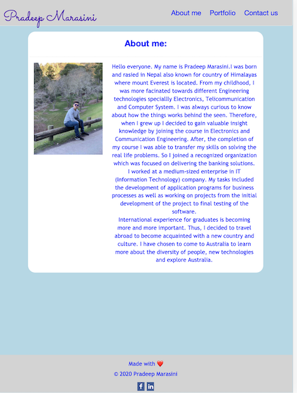
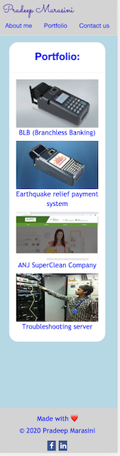

# pradeep-marasini-portfolio
Responsive Portfolio

## Basic Overview - [Live Demo](https://marasinipradeep.github.io/pradeep-marasini-portfolio/)

This is fully functional  portfolio which is build considering responsiveness to different devices and window or screen sizes.

#### Features

-Accessibility
- Semantic and logical order of HTML elements.
- All the images with "alt" attributes.
- Contains personal information
- Responsive to different screen sizes
 large: >=1200px wide
 medium : >=992px wide
 small : >=768px wide

## Tools and Technology used

Tools
-----------
-vs code
-Google chrome

Technology
------------
-HTML
-CSS
-Bootstrap

## Getting started

-First of all, Clone the project from github to local machine.
-Alternatively, you can download the .zip file and extract in suitable folder on local machine. 
-Open the file with suitable code editor (For examplle:-Visual Studio code, Sublime Text, Atom etc).
-You can view live demo clicking on link above.

## Screenshots of final outputs

